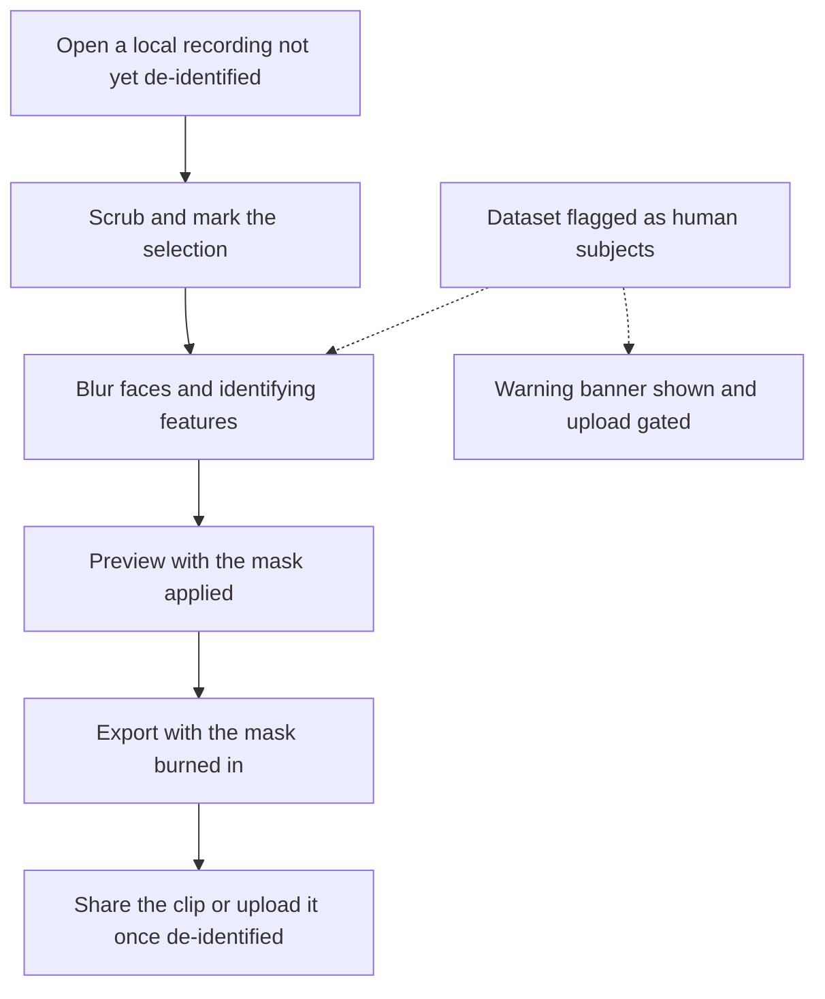

# Story 10: Blur people before sharing

**Persona:** Researcher working with videos involving human subjects.

> As a **researcher working with data involving human subjects**, I want to mask faces and identifying features in a clip taken from my own recording before it leaves my machine, so that nothing identifiable is in what I share or upload.

**Why it matters.** BBQS includes human intracranial and behavioral studies where video of participants is a core modality. Care has to apply to clip extraction: a three-second excerpt of a participant's face is still identifiable.

**Acceptance criteria**

- I can open a local recording that has not been de-identified, mark a selection, and blur a region of the frame before exporting.
- The mask is burned into the exported clip or still, rather than being a setting a later viewer could switch off.
- Blurring happens in the browser along with the rest of the extraction, so the un-blurred video never leaves my machine.
- When a dataset is flagged as holding human-subjects data, the warning banner and the blur tool appear on their own and uploading is gated, so protection does not depend on my remembering to turn anything on.

> [!NOTE]
> The blur tool is currently aimed at local videos that have not yet been de-identified. EMBER-DANDI holds only already de-identified content, so a recording streamed from the archive should not need redaction; the warning and the blur exist for the step before data reaches the archive.

---

[All Clip Extractor stories](README.md) · Previous: [Story 9](story-09-nothing-leaves-the-browser-unless-i-say-so.md) · Next: [Story 11](story-11-record-where-a-clip-came-from.md)
